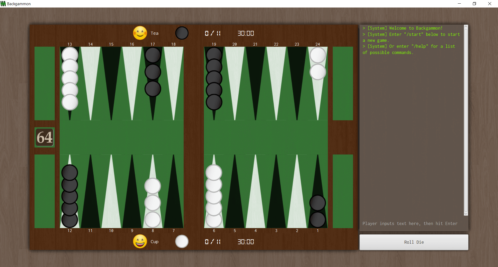
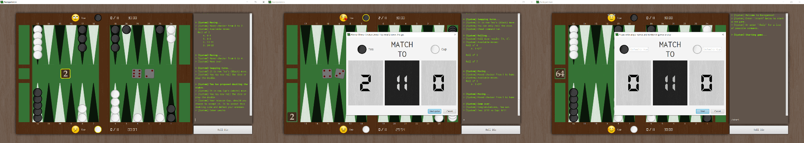
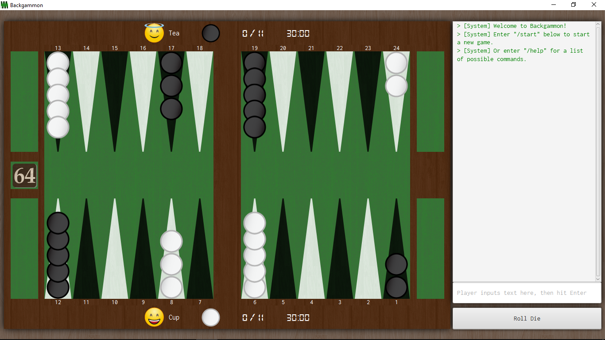
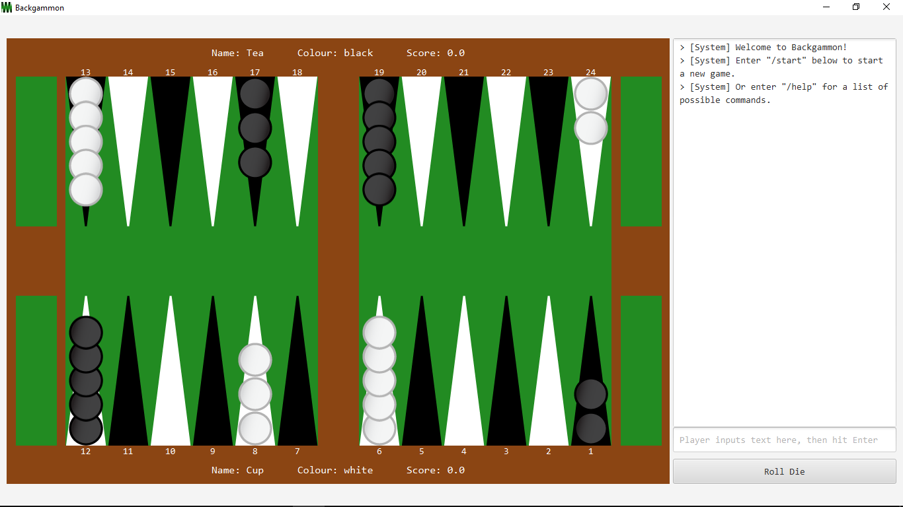
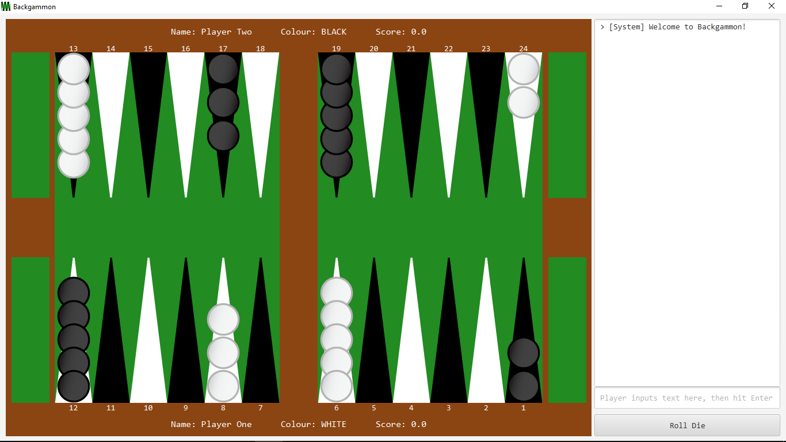

# Backgammon

An attempt to create one of the oldest known board games.

&nbsp;
## About the project

A COMP20050 Software Engineering Project made from January to April 2019. We are a team of three that implemented the game UI, logic, and a bot to play the game, using the Scrum methodology in sprints of 5. We also developed extra features outside the 5 product backlogs required. 

The final product in the master branch are the results of 4 sprints. The program has a UI and is able to play any number of matches the player wishes. 

We implemented the bot using the lecturer provided code base for compatibility reasons. All bot submitted are to face off in a tournament as part of grading. Please go to the bot/sprint 5 branch to see more details.

&nbsp;
## About Backgammon
see [Wikipedia](https://en.wikipedia.org/wiki/Backgammon)
> It is a two player game where each player has fifteen checkers which move between twenty-four points according to the roll of two dice, with the objective to be the first to bear off all fifteen of their checkers off the board.

&nbsp;
## IDE or Text Editors

There are many Java IDE or text editors to choose from, ultimately, which to use is subjective, so choose the one that suits you.

Personally, I prefer Eclipse for Java.

- [Downloading and using Eclipse](https://www.eclipse.org/downloads/)

&nbsp;
## Running the game
1. Open Eclipse, and create a new Java project.
2. Right click the newly created src folder.
3. Click Import..
4. Click General -> File System -> Next.
5. Click Browse..
6. Browse to the folder that contains all the content of the repository.
7. Select that folder.
8. Tick all the files, i.e. constants, events, game_engine, img, etc.
9. Click Finish.
10. Open and run Main.java.

&nbsp;
## Authors
* [bryansng](https://github.com/bryansng)
* [LxEmily](https://github.com/LxEmily)
* [Abuden](https://github.com/Abuden)

&nbsp;
## Acknowledgments
- Our parents
- UCD Student Union's coffee machine
- Stack Overflow
- Oracle Documentations

&nbsp;
## How we did it as a whole:
- **_Explore Objected Oriented Design concepts and techniques_**, to learn how to maintain our code. This is why we modularized and objectified almost everything in the application, this can be seen as a bit too much classes, but when it comes down to maintaining, you will know exactly where the problem is (i.e which class contains the culprit).

- **_Separate interactions between objects_**. With OOP, comes the interaction between objects. For two objects to interact with each other, a class is used to facilitate the interaction, this class is called the Controller class.

  The higher up the interaction chain, the more interaction there is, to the point where the top class handles all the interaction between all the objects. The lower down you go, the less interaction there is, to the point where the objects interact with themselves (i.e. initialize, set and get their own instance variables).

  There are many controller classes used for the interaction between objects in this application. i.e. MainController (interaction between GameController, CommandPanel, InfoPanel, RollDieButton), GameController (Bar, Home, Board, UserPanels), Board (Points, Dices, Checkers), Point (Checkers), Bars (Bar), HomePanel (Home), etc.

  If there's a bug in the code, what we do is understand how the objects interact with each other, then go to the class file that handles the interaction, then work our way down the interaction chain to find the bug.

  For instance, for some reason, we typed /move 1 2, a black checker is at point 2, a white checker is at point 1, black checker is supposed to get hit and go to bar. Command is entered, but the black checker doesn't move. We know that /move commands relies on *CommandPanel* to work, relays system messages through *InfoPanel*, and moves are made through *Board*. The code of /move is definitely in MainController, which it is. Then you work your way down from MainController, to GameController or Board, or wherever to fix the bug, relying heavily on Java's error stack trace.

- **_Classes with a lot of interactions between objects, separated via specialized classes and inheritance_**. As the project progresses, classes like MainController and Board will have a lot of functions, which means a lot of lines of code. A way to refactor would be to use specialized classes.

  For example, MainController used to store all interactions between Command Panel, Info Panel, RollDieButton and the Game, these interactions include *handling events* and *handling commands*. Therefore, we separate the codes using specialized classes like *EventController* and *CommandController*. Further increasing maintainability of code.
  
  For instance, Board used to handle its *functions* (moveCheckers, action methods) and its *initialization* (itself, dices, pips and checkers). Since maintaining code generally happens in the *functions* side of things, it would be nice to separate *functions* and *initialization*. Hence, BoardComponents is the superclass with *initialization* and Board is the subclass that has all the *functions*.

&nbsp;
## Sprint 5 - Bot Documentation

**Details in bot branch.**

&nbsp;
&nbsp;

## Sprint 4 - Short Documentation

### Requirements:
|     | Requirements              | Our interpretation        |
| --- | ------------------------- | ------------------------- |
| <ul><li>[x] </li></ul> | Ask players the number of points they're playing to at the beginning of the match.  | Prompt for player names and number of points in one single dialog prompt. NOTE: Click the black score in the middle to change the number of points to play to. |
| <ul><li>[x] </li></ul> | Display doubling cube, match score and match length on the board panel | Doubling cube displayed on the left. Match score and match length are displayed on the player panels. |
| <ul><li>[x] </li></ul> | Players can enter 'double' command before their play. | 👍 NOTE: "/double" and "double" both work. |
| <ul><li>[x] </li></ul> | If doubling not legal at that time, display error message. | Doubling is allowed before rolling and if game is not a Crawford game. |
| <ul><li>[x] </li></ul> | The player receiving the doubling cube may accept or reject it. If accepted, update the cube to show ownership. If rejected, end the game and allocate points to the winner. | The doubling cube is placed in the left homes of the player to show ownership and doubling value. |
| <ul><li>[x] </li></ul> | On game over, update match score on board and report new match score on info panel. | On game over, match score is updated on player panels on board, a dialog prompt, and info panel. The dialog prompt also asks if players want to continue to the next game. | 
| <ul><li>[x] </li></ul> | On game over, ask players to press any key to start the next game in the match. | Players are given autonomy - they are asked if they want to continue to the next game with a dialog prompt. If they decline, the game enters free-for-all mode. After declining, players may use "/start" to resume next game. | 
| <ul><li>[x] </li></ul> | On match over, announce winner and ask if players want to play again. | On match over, winner is announced on info panel and a dialog prompt. The prompt also asks if players want to play again. Players are given autonomy - if they decline, the game enters free-for-all mode. |
| <ul><li>[x] </li></ul> | Modify 'cheat' command to 13 checkers being bore off and 2 checkers on the ace point for both sides. | 👍 NOTE: "/cheat" and "cheat" both work. |
| <ul><li>[x] </li></ul> | Player may use 'quit' command to terminate program at any time. | 👍 NOTE: Done in Sprint 1, "/quit" and "quit" both work. |
| <ul><li>[x] </li></ul> | Implement Crawford Rule, Dead Cube, doubling and match score as per the clarifications email. | 👍 NOTE: This game allocates 3 points to the winner on a Backgammon as per the rules, but the clarifications email allocates 2 points.  |

&nbsp;
### Who did what:
see [Trello](https://trello.com/b/A4LqsqAB/backgammon)

| Bryan             | Emily & Braddy    |
| ----------------- | ----------------- |
| Display doubling cube, match score and match length on the board panel. | Ask players the number of points they're playing to at the beginning of the match. |
| Players can enter 'double' command before their play. If doubling not legal at that time, display error message. | On game over, update match score on board and report new match score on info panel. |
| If doubling not legal at that time, display error message. | On game over, prompt players to start the next game in the match. |
| The player receiving the doubling cube may accept or reject it. Update the game on accept/decline. | On match over, announce winner and ask if players want to play again. |
| Implement Crawford Rule and Dead Cube. | "quit" and "cheat" commands. |

#### Additionally, we also did
- Made all commands are case-insensitive. The game converts all commands to lowercase internally.
- Represented players with emojis, which react to gameplay, e.g. sad face when jailed.
- Beautified game start/end prompts to look like a scoreboard. 
- Combined prompts for player names, colors, and number of points.
- Added a timer that mimics tournament timers, e.g. players having 15s to roll die. 
- Added dice roll sounds.
- Added a digital font for scores and timers. 
- Added dark mode, which changes info panel to look like a terminal. 
- Compression, refactoring, and testing.

&nbsp;
&nbsp;

## Sprint 3 - Short Documentation

### Requirements:
|     | Requirements              | Our interpretation        |
| --- | ------------------------- | ------------------------- |
| <ul><li>[x] </li></ul> | App lists legal plays available after player rolls the die. This includes hits, bear offs, and doubles. The format is "#-# #-#" (# for pip numbers, 'Off' for bearing off, 'Bar' for jail, and asterisk to indicate a hit). The list of legal plays does not include duplicate plays, i.e. plays leading to the same board position.  | Note: Plays are printed vertically down instead of horizontally right. |
| <ul><li>[x] </li></ul> | App automatically moves then rolls for the next player if there are zero/one possible move(s). App waits to inform player of these automatic events. | Check for possible moves, then call the next function, which calls the roll function internally. App "pauses" to inform players.  |
| <ul><li>[x] </li></ul> | The displayed list of legal plays are numbered alphabetically, i.e. A, B, ..., Z, AA, AB, ... | Able to translate moves from A to ZZ. |
| <ul><li>[x] </li></ul> | Players may make their moves by typing the corresponding alphabet. The input is case-insensitive, and leading/trailing spaces are allowed. If the input is invalid, app shows error message and prompts player again. | Note: Players can make moves by clicking, "# #" command, "/move # #" command, and typing the corresponding alphabet.  |
| <ul><li>[x] </li></ul> | Display all plays on the board. | Display plays based on their dice results. (looks neater and easier to identify) |
| <ul><li>[x] </li></ul> | "cheat" command that causes all checkers given positions for testing purposes. Plays can be made from there. | On "cheat", delete all checkers (logically and visually) on board, then add checkers to the specified positions. If game has started, recalculate the possible moves to play from there. |
| <ul><li>[x] </li></ul> | Game terminates on "quit". | Done in sprint 1. Both "quit" and "/quit" will terminate the game.  |
| <ul><li>[x] </li></ul> | On game over, announce winning player. | Game over if a player has exactly 15 checkers at their home. Announcement is made on InfoPanel and a dialog prompt. Game exits gameplay mode and enters free-for-all mode. |

&nbsp;
### Who did what:
see [Trello](https://trello.com/b/A4LqsqAB/backgammon)

| Bryan         | Emily         | Braddy        |
| ------------- | ------------- | ------------- |
| List legal plays available with correct formatting and without duplicate plays. | "cheat" command, which is possible to play from, for testing purposes. | App automatically moves then rolls for the next player if there are zero/one possible move(s), then waits to inform player of these automatic events. |
| The displayed list of legal plays are numbered alphabetically, i.e. A, B, ..., Z, AA, AB, ... . | On game over, announce winning player. | Players may make their moves by typing the corresponding alphabet, case-insensitive, whitespace allowed. |

#### Additionally, we also did
- Added textured backgrounds to the UI.
- Styled info panel messages.
- Optimized the app through refactoring and compressing game files. The game should not lag as it progresses.
- Command panel stores player input history like a terminal (hit up/down to see).
- Added sounds when checkers are moved, hit, bore on/off.
- Added background music and associated commands.
- Added font as a game file so different OSs can see it. Added function for easy reference internally.

&nbsp;
&nbsp;

## Sprint 2 - Short Documentation

### Requirements:
|     | Requirements              | Our interpretation        |
| --- | ------------------------- | ------------------------- |
| <ul><li>[x] </li></ul> | Announce the game.        | Welcome players at application start in Info Panel. Game is announced when players start it. |
| <ul><li>[x] </li></ul> | Get player names and tell them their checkers' colors. | A dialog to prompt players to input their names and checker colors when they start the game. |
| <ul><li>[x] </li></ul> | Roll to see who moves first. Roll results are used as starting value. Roll again if dice values are equal. | At game start, roll automatically and prompt players to move based on the rolls. The roll function recursively rolls until the die result are not equal, so to the players, the die result is never equal. |
| <ul><li>[x] </li></ul> | Allow players to takes turns to roll and move around the board. | 👍 |
| <ul><li>[x] </li></ul> | Rolls are automatic. | All rolls are automatic at start of game ("/start") and change of turn (i.e. "/next"). |
| <ul><li>[x] </li></ul> | Moves should be entered as "'starting pip' 'ending pip'", e.g. "6 3". | Moves may be made using "/move # #", "# #", or mouse clicks. |
| <ul><li>[x] </li></ul> | The program returns errors if there are no checkers at the starting pip, if the pip numbers are out of range, or if the command format is invalid. | Errors are returned for the former two. The program echoes whatever is not in the correct command format on the info panel. |
| <ul><li>[x] </li></ul> | Players are allowed to enter a move again after an error. | Players are allowed to move as long as there are moves left, even in the case of an invalid move. |
| <ul><li>[x] </li></ul> | Players are only allowed to enter one move at a time. | Move command takes in only 2 arguments, i.e. source and destination, which is only a move. |
| <ul><li>[x] </li></ul> | The moves do not have to match the dice roll or avoid opponent blocks yet. The program does not need to check that the move is valid yet. | 👍 |
| <ul><li>[x] </li></ul> | When the player enters "next", the current player's turn is over and the other player should then roll and move. | Player enter "/next" or "next" to switch turns. Die is rolled automatically each turn. |
| <ul><li>[x] </li></ul> | The pip numbers at the edge of the board should be correct for the player who is moving their checkers, i.e. pip numbers change depending on whose move is it. | Depending on the player's perspective, pip numbers automatically change relative to that every "/next". |
| <ul><li>[x] </li></ul> | Program terminates on "quit". | Done in Sprint 1. Players quit game using "/quit", "quit", or the window close button. |

&nbsp;
### Who did what:
see [Trello](https://trello.com/b/A4LqsqAB/backgammon)

| Bryan         | Emily         |
| ------------- | ------------- |
| Roll to see who moves first. Use roll results as staring values. Roll again if dice values are equal. | Announce the game. (See info panel at application start and game start). |
| Allow players to takes turns to roll and move around the board. | Get player names and tell them their checkers' colors, using a dialog prompt. |
| Error checking on pips, checkers, moves, and commands. Players can move again after an error. Players can only enter one move at a time. | Rolls are automatic (at start of game and start of turn).  |
| Player enters "next" to change turns. | Moves should be entered as "'starting pip' 'ending pip'", e.g. "6 3". (Note that moves may also be made with "/move # #" and mouse clicks.) |
| The pip numbers at the edge of the board should be correct for the player who is moving their checkers. | Documentation. |

#### Additionally, we also did
##### Extra:
- "/start" command to start a new game.
- "/help" command to see a list of possible commands.
- "/reset" command to reset the entire application.
- "/restart" command to restart the game (without losing player info).
- Parsing players' one-based input as zero-based values in game functions to prevent errors.
- Calculate and validate possible moves depending on die roll (bar and home not considered yet).
- Highlight top checkers and pips as possible moves.
- Die displayed on board made prettier. (They rotate randomly).
- Refactoring along the way.
- Note that explicitly required commands can be called with or without "/". E.g. /move, /next, /quit.

##### Restrictions:
- "/start" can only be called when it is in free-for-all mode (i.e. not gameplay mode).
- "/roll" called automatically after "/start" and "/next" in gameplay mode.
- "/move" can only be called after "/roll" in gameplay mode.
- "/next" can only be called after "/move" in gameplay mode.
- "/start", "/roll" and "/move" can be called in free-for-all mode.
- "/next" cannot be called in free-for-all mode.

&nbsp;
&nbsp;
## Sprint 1 - Short Documentation

### Requirements:
#### UI-wise:
- [x] Board Panel displaying the game.
- [x] Board Panel with number of the pips.
- [x] Board Panel with room for doubling cube and match score.
- [x] Information Panel displaying game information.
- [x] Command Panel allowing users to enter commands.
- [x] Command Panel echo whatever user enters to information panel (NOTE: whitespace not accepted).
- [x] Command Panel terminate application on input quit.

#### Game-wise:
- [x] Board with initial position of players' checkers.
- [x] Board with ability to move checkers around the board, bear-off, bear-on, get hit via mouse or keyboard.

&nbsp;
### Who did what:
see [Trello](https://trello.com/b/A4LqsqAB/backgammon)

| Bryan         | Emily         |
| ------------- | ------------- |
| Board panel, including  checkers, pips, numbers on pips, and space for doubling cube and match score.    | Information panel that displays game info. |
| Initial board displayed with checkers in the correct places     | Command panel that takes in player input.      |
| Move checkers from bar to bear off. (Done with "/test", may also be "/move"d or clicked) | Echo user input from command panel to info panel. Terminate with "quit" (or "/quit") command.      |

Additionally, we also did
- Initialize dice and alternating rolling die between two players
- Additional space for player info
- Home and jail
- Highlighting pips when clicked
- Inform player of result of moving checkers and rolling die
- "Stacking" checkers up so they don't go over the pips
- Ignore player input if it is empty or only contains whitespace
- All our commands start with "/", but simply typing the keyword also works
- Save (or auto save before quitting) contents of info panel to text file
- Prompt player to confirm when quitting game